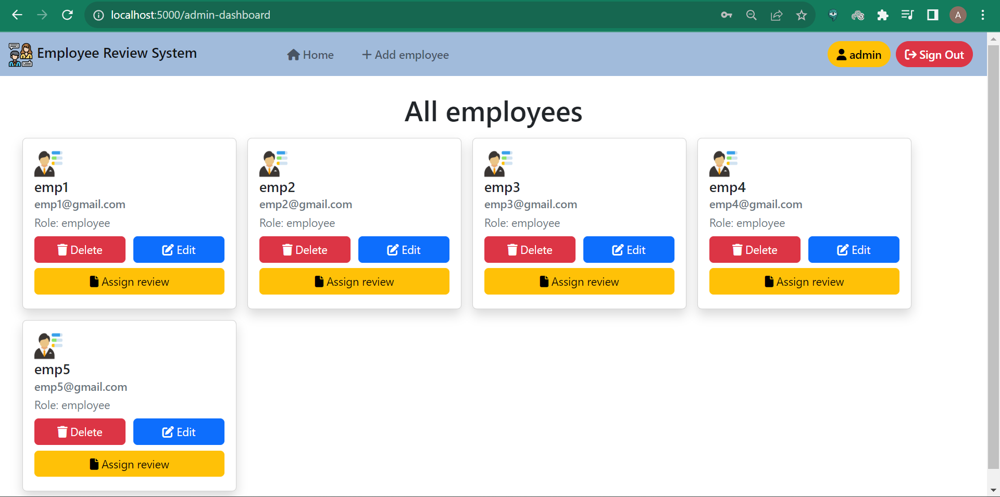
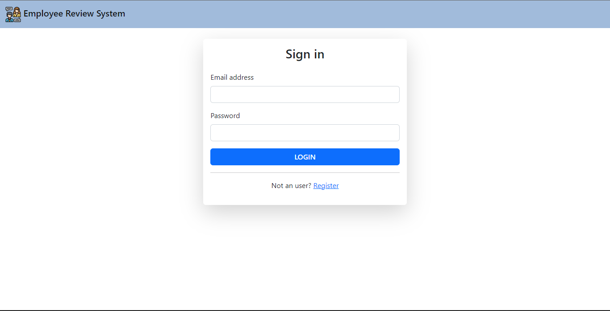
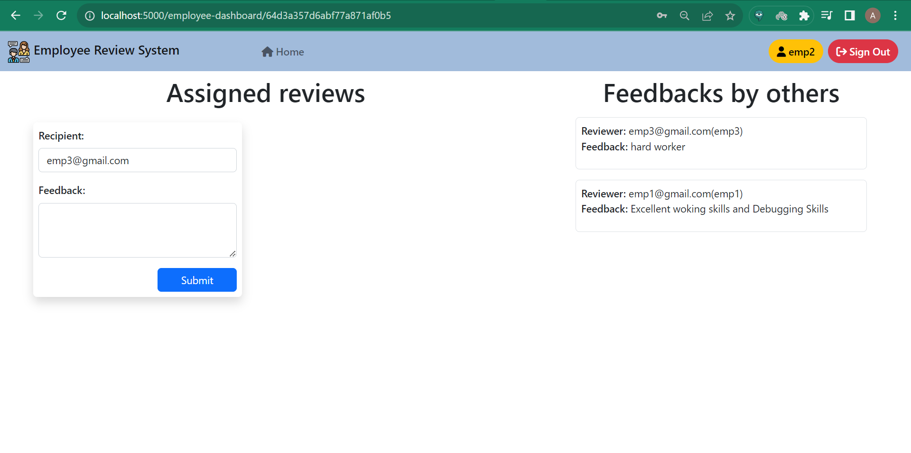

# Employee-Review-System

This Employee review web application is created for employees to submit feedback toward each other's performance. User's could have either "employee" or "admin" role. There are two dashboard pages based on the role of the employee those dashboard pages will be rendered, User with role of admin can assign employees to participate in review of other employees. Employees can only submit feedback required by assigned reviews.

### 🔗 Hosted link: [Employee review system](https://employee-review-system-ze20.onrender.com/)



## ⚙️ Functionality

### Admin's functions

- Add employee
- Delete employee
- Update employee details
- Assign review to employee
- Update review of employee

### Employee's functions

- Submit reviews assigned to it
- View reviews given by others

## 🧑‍💻 Getting started

- Install all required packages

```bash
npm install
```

- Run project

```bash
npm start or nodemon index.js
```

The project is running on the port number provided by you.

## 🛠️ Tools Used

- NodeJS
- MongoDB
- ExpressJS
- EJS
- Bootstrap

### 📚 Libraries:

- bcryptjs
- connect-flash
- connect-mongo
- cookie-parser
- dotenv
- ejs
- express
- express-ejs-layout
- express-session
- mongoose
- passport
- passport-jwt
- passport-local

## 🖼️ Screenshots





